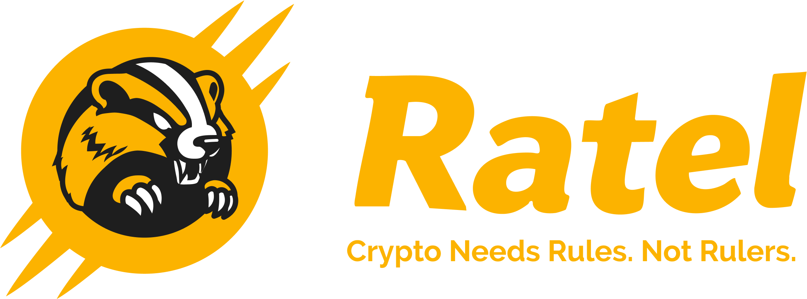

<a id="readme-top"></a>

[![Contributors][contributors-shield]][contributors-url]
[![Forks][forks-shield]][forks-url]
[![Stargazers][stars-shield]][stars-url]
[![Issues][issues-shield]][issues-url]
[![Unlicense License][license-shield]][license-url]
[![LinkedIn][linkedin-shield]][linkedin-url]


<!-- PROJECT LOGO -->
<br />
<div align="center">
  <a href="https://github.com/biyard/ratel">
    
  </a>

  <h3 align="center">Ratel</h3>

  <p align="center">
    Project details
    <br />
    <a href="https://github.com/biyard/ratel"><strong>Explore the docs »</strong></a>
    <br />
    <br />
    <a href="https://github.com/biyard/ratel">View Demo</a>
    &middot;
    <a href="https://github.com/biyard/ratel/issues/new?labels=bug&template=bug-report---.md">Report Bug</a>
    &middot;
    <a href="https://github.com/biyard/ratel/issues/new?labels=enhancement&template=feature-request---.md">Request Feature</a>
  </p>
</div>


<!-- TABLE OF CONTENTS -->
<details>
  <summary>Table of Contents</summary>
  <ol>
    <li>
      <a href="#about-the-project">About The Project</a>
      <ul>
        <li><a href="#built-with">Built With</a></li>
      </ul>
    </li>
    <li>
      <a href="#getting-started">Getting Started</a>
      <ul>
        <li><a href="#prerequisites">Prerequisites</a></li>
        <li><a href="#installation">Installation</a></li>
      </ul>
    </li>
    <li><a href="#usage">Usage</a></li>
    <li><a href="#roadmap">Roadmap</a></li>
    <li><a href="#contributing">Contributing</a></li>
    <li><a href="#license">License</a></li>
    <li><a href="#contact">Contact</a></li>
    <li><a href="#acknowledgments">Acknowledgments</a></li>
  </ol>
</details>


<!-- ABOUT THE PROJECT -->
## About The Project

[![Main Page][product-screenshot]](https://ratel.foundation)

Ratel is the **world’s first decentralized legislative platform** designed to bridge the gap between **crypto users and policymakers**. Built on **blockchain and AI**, Ratel ensures **transparency, governance, and active community participation** in shaping crypto regulations.

In many countries, including South Korea, crypto regulations are **lagging behind** while policymakers and industry stakeholders remain disconnected. **Institutional participation is limited, ICOs and IEOs are banned, and startups are forced to move abroad** due to unclear regulations. This has turned the crypto market into a **speculative space dominated by retail investors, rather than an environment fostering sustainable innovation**.

Ratel **empowers the community** by providing: \
 ✅ **A transparent database** tracking lawmakers' crypto stances and regulatory proposals. \
 ✅ **A DAO-based governance system** where users can **discuss, propose, and vote on legislation**. \
 ✅ **AI-powered legislative assistance** to help draft policy suggestions. \
 ✅ **Advocacy and lobbying efforts** to ensure community-driven regulations reach policymakers.

Our ultimate goal is to create a **fair, transparent, and innovation-friendly crypto regulatory framework**—and eventually **expand beyond crypto into other policy domains, such as AI regulations.**

<p align="right">(<a href="#readme-top">back to top</a>)</p>


### Built With

* 
* 
* 

<p align="right">(<a href="#readme-top">back to top</a>)</p>


<!-- GETTING STARTED -->
## Getting Started

This is an example of how you may give instructions on setting up your project locally.
To get a local copy up and running follow these simple example steps.

### Prerequisites

This is an example of how to list things you need to use the software and how to install them.
* rust
  ```sh
  curl --proto '=https' --tlsv1.2 -sSf https://sh.rustup.rs | sh
  ```

* Dioxus
  - Refer to [Dioxus getting started](https://dioxuslabs.com/learn/0.6/getting_started/#install-cargo-binstall)
  ``` sh
  cargo install cargo-binstall
  cargo binstall dioxus-cli
  ```

### Building

Coming soon

<p align="right">(<a href="#readme-top">back to top</a>)</p>


<!-- USAGE EXAMPLES -->
## Usage

Coming soon

<p align="right">(<a href="#readme-top">back to top</a>)</p>


<!-- ROADMAP -->
## Roadmap

🚀 **Q1 2025 – Platform Launch & Community Building**


* Launch the official Ratel website & social media presence.
* Introduce $RATEL governance token.
* Begin beta testing of the platform, focusing on **lawmakers’ stance tracking** and **community engagement**.

🗳️ **Q2 2025 – DAO Governance & Legislative Participation**


* Enable **DAO-based proposal and voting system** for policy discussions.
* Launch **transparency dashboard** to track **crypto-related bills and policies**.
* Conduct **awareness campaigns** to encourage participation in decentralized governance.
* Launch the **airdrop feature** for $RATEL

🏛️ **Q3 2025 – Policy Advocacy & Expansion**


* Host **public forums, policy discussions, and community events** to increase engagement.
* Collaborate with **crypto-friendly lawmakers and industry leaders** to influence policy decisions.
* Begin developing **AI-assisted legislative drafting tools**.

🌍 **2026 & Beyond – Global Expansion & Institutional Adoption**


* Expand the Ratel model to **other policy categories (AI governance, digital rights, etc.)**.
* Extend the platform to **global markets**, creating a **multi-national decentralized governance ecosystem**.
* Pursue **institutional partnerships and regulatory collaborations** for greater policy impact.

<p align="right">(<a href="#readme-top">back to top</a>)</p>


<!-- CONTRIBUTING -->
## Contributing

Contributions are what make the open source community such an amazing place to learn, inspire, and create. Any contributions you make are **greatly appreciated**.

If you have a suggestion that would make this better, please fork the repo and create a pull request. You can also simply open an issue with the tag "enhancement".
Don't forget to give the project a star! Thanks again!

1. Fork the Project
2. Create your Feature Branch (`git checkout -b feature/AmazingFeature`)
3. Commit your Changes (`git commit -m 'Add some AmazingFeature'`)
4. Push to the Branch (`git push origin feature/AmazingFeature`)
5. Open a Pull Request

### Top contributors:

<a href="https://github.com/biyard/ratel/graphs/contributors">
  
</a>

<p align="right">(<a href="#readme-top">back to top</a>)</p>


<!-- LICENSE -->
## License

Distributed under the Unlicense License. See `LICENSE.txt` for more information.

<p align="right">(<a href="#readme-top">back to top</a>)</p>


<!-- CONTACT -->
## Contact

Your Name - [@your_twitter](https://twitter.com/your_username) - email@example.com

Project Link: [https://github.com/your_username/repo_name](https://github.com/your_username/repo_name)

<p align="right">(<a href="#readme-top">back to top</a>)</p>


<!-- ACKNOWLEDGMENTS -->
## Acknowledgments

Use this space to list resources you find helpful and would like to give credit to. I've included a few of my favorites to kick things off!

* [Rust](https://www.rust-lang.org/)
* [Dioxus](https://dioxuslabs.com/)
* [Axum](https://github.com/tokio-rs/axum)
* [Tailwindcss](https://tailwindcss.com/)

<p align="right">(<a href="#readme-top">back to top</a>)</p>

<!-- MARKDOWN LINKS & IMAGES -->
<!-- https://www.markdownguide.org/basic-syntax/#reference-style-links -->
[contributors-shield]: https://img.shields.io/github/contributors/biyard/ratel.svg?style=for-the-badge
[contributors-url]: https://github.com/biyard/ratel/graphs/contributors
[forks-shield]: https://img.shields.io/github/forks/biyard/ratel.svg?style=for-the-badge
[forks-url]: https://github.com/biyard/ratel/network/members
[stars-shield]: https://img.shields.io/github/stars/biyard/ratel.svg?style=for-the-badge
[stars-url]: https://github.com/biyard/ratel/stargazers
[issues-shield]: https://img.shields.io/github/issues/biyard/ratel.svg?style=for-the-badge
[issues-url]: https://github.com/biyard/ratel/issues
[license-shield]: https://img.shields.io/github/license/biyard/ratel.svg?style=for-the-badge
[license-url]: https://github.com/biyard/ratel/blob/master/LICENSE.txt
[linkedin-shield]: https://img.shields.io/badge/-LinkedIn-black.svg?style=for-the-badge&logo=linkedin&colorB=555
[linkedin-url]: https://linkedin.com/in/othneildrew
[product-screenshot]: images/main.png
