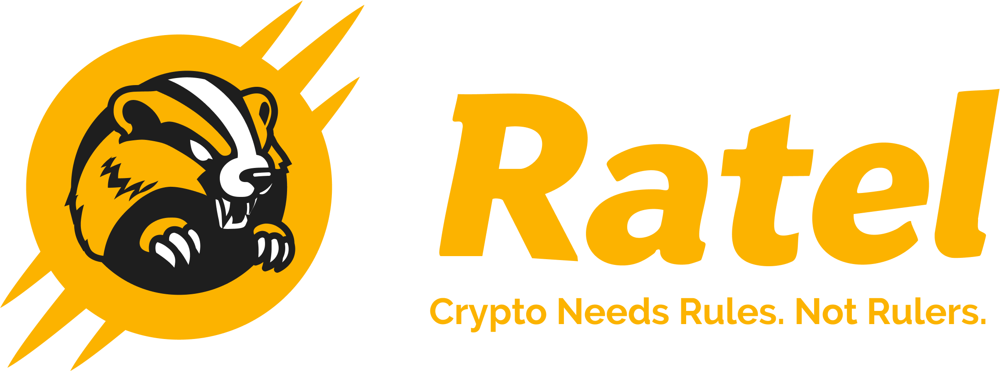

<a id="readme-top"></a>

[![Contributors][contributors-shield]][contributors-url]
[![Forks][forks-shield]][forks-url]
[![Stargazers][stars-shield]][stars-url]
[![Issues][issues-shield]][issues-url]
[![Unlicense License][license-shield]][license-url]
[![LinkedIn][linkedin-shield]][linkedin-url]


<!-- PROJECT LOGO -->
<br />
<div align="center">
  <a href="https://github.com/biyard/ratel">
    
  </a>

  <h3 align="center">Ratel</h3>

  <p align="center">
    Project details
    <br />
    <a href="https://github.com/biyard/ratel"><strong>Explore the docs »</strong></a>
    <br />
    <br />
    <a href="https://github.com/biyard/ratel">View Demo</a>
    &middot;
    <a href="https://github.com/biyard/ratel/issues/new?labels=bug&template=bug-report---.md">Report Bug</a>
    &middot;
    <a href="https://github.com/biyard/ratel/issues/new?labels=enhancement&template=feature-request---.md">Request Feature</a>
  </p>
</div>


<!-- TABLE OF CONTENTS -->
<details>
  <summary>Table of Contents</summary>
  <ol>
    <li>
      <a href="#about-the-project">About The Project</a>
      <ul>
        <li><a href="#built-with">Built With</a></li>
      </ul>
    </li>
    <li>
      <a href="#getting-started">Getting Started</a>
      <ul>
        <li><a href="#prerequisites">Prerequisites</a></li>
        <li><a href="#installation">Installation</a></li>
      </ul>
    </li>
    <li><a href="#usage">Usage</a></li>
    <li><a href="#troubleshooting">Troubleshooting</a></li>
    <li><a href="#roadmap">Roadmap</a></li>
    <li><a href="#contributing">Contributing</a></li>
    <li><a href="#license">License</a></li>
    <li><a href="#contact">Contact</a></li>
    <li><a href="#acknowledgments">Acknowledgments</a></li>
  </ol>
</details>


<!-- ABOUT THE PROJECT -->
## About The Project

[![Main Page][product-screenshot]](https://ratel.foundation)

Ratel is a **Human Essence Platform** — a place where the thoughts, insights, and activities of real people are captured, embedded, and turned into a personal asset you can *use*, *share*, and *monetize*.

Every post you write, every space you join, every vote, comment, and discussion you take part in becomes part of **your Essence**: a RAG- and embedding-backed representation of how *you* think. Your Essence is yours. You can query it, plug it into your own ChatGPT or Claude Desktop, let an agent act on your behalf, or sell **subscription access** to it through your **Essence House**.

### What you can do on Ratel

🧠 **Build your Essence from real activity** — Posts, comments, votes, and space actions are embedded into a personal knowledge base that grows as you participate. AI-authored content is excluded by default; you opt in per source.

🔌 **Connect the tools you already use** — The **Essence Connector** pulls from platforms you already write in (Notion first, more to come) via read-only OAuth and real-time webhooks, so your existing knowledge doesn't have to be re-created.

🏠 **Open an Essence House** — Every user gets one House that bundles their Essence. Set your own subscription price. Subscribers get a **single unified MCP endpoint** they register in ChatGPT, Claude Desktop, or any MCP-compatible client — one URL that routes across every House they subscribe to.

🤖 **Deploy an agent for passive income** — Build an agent from your Essence and let it participate in reward-bearing spaces (polls, discussions, quizzes, follow quests) that opt in to agent participation. Hosts can block agents. Quality and direct-activity scoring keep the signal high.

📊 **Share in report revenue** — When a space host publishes a report (AI-assisted, host-authored), sales revenue is split: **10% platform · 60% host · 30% contributors** (weighted by contribution relevance to the final report). Off-chain settlement first, on-chain opt-in later.

🔒 **Your Essence, your rules** — Essences are user assets, fully deletable. Subscriptions sell *inference access only* — never raw posts, never your original content.

Ratel started as a decentralized legislative platform and has evolved into a platform for **any collective where human thought is the product**. The underlying primitives — spaces, posts, polls, discussions, rewards, MCP — remain, but they now serve a larger goal: making a person's essence a first-class, portable, monetizable asset.

<p align="right">(<a href="#readme-top">back to top</a>)</p>


### Built With

* 
* 
* 
* 
* 
* 

<p align="right">(<a href="#readme-top">back to top</a>)</p>


<!-- GETTING STARTED -->
## Getting Started

This is an example of how you may give instructions on setting up your project locally.
To get a local copy up and running follow these simple example steps.

### Prerequisites

This is an example of how to list things you need to use the software and how to install them.
* rust
  ```sh
  curl --proto '=https' --tlsv1.2 -sSf https://sh.rustup.rs | sh
  ```

### Building

``` sh
make run
```

<p align="right">(<a href="#readme-top">back to top</a>)</p>


<!-- USAGE EXAMPLES -->
## Usage

Coming soon

<p align="right">(<a href="#readme-top">back to top</a>)</p>


<!-- TROUBLESHOOTING -->
## Troubleshooting

For common issues and solutions, see the [Troubleshooting Guide](docs/troubleshooting.md).

<p align="right">(<a href="#readme-top">back to top</a>)</p>


<!-- ROADMAP -->
## Roadmap

The pivot to a Human Essence Platform is organized into five phases. Earlier phases build the substrate; later phases turn it into a marketplace and an agent economy.

🧬 **Phase 0 — Essence Foundation**

* `EssenceSource` model covering Post, Comment, Vote, Action, and external connected docs
* Embedding pipeline on top of the existing DynamoDB Stream → EventBridge infrastructure
* Backfill embeddings for existing posts, comments, and votes
* Quality score + direct-activity index (content count, community votes) batch jobs

🔌 **Phase 1 — Essence Connector (Notion first)**

* Read-only OAuth integration with Notion
* Initial sync → embedding queue, real-time webhook → re-embed on change
* User settings UI: connection state, per-source on/off, manual re-sync
* Agent-authored content: excluded by default, user opt-in per source

🏠 **Phase 2 — Essence House + MCP Subscriptions**

* House auto-generated per user (1 user = 1 House)
* Owner-set subscription pricing; off-chain billing
* Extend the existing Ratel MCP server with subscriber-token routing
* Unified MCP endpoint per subscriber → routes across every subscribed House
* Tools: `list_houses`, `query_house`, `search_essence` (cross-House)

🛒 **Phase 3 — Essence Marketplace**

* House discovery with quality-score badges and sample outputs
* Subscribe flow + billing management
* Owner dashboard: subscribers, revenue, Essence sources
* Subscriber dashboard: subscribed Houses and their unified MCP URL

🤖 **Phase 4 — Agents & Report Revenue Share**

* Agent configuration UI: source House, allowed actions, target spaces
* Platform-hosted agent runtime; hosts can allow or block agents per space
* AI-assisted report authoring inside spaces
* Contribution scoring (relevance of participant activity to the final report)
* Revenue split engine: **10% platform · 60% host · 30% contributors**
* Off-chain settlement first; on-chain settlement as an opt-in setting later

🌍 **Beyond** — multi-source connectors (Google Docs, Substack, X, Slack), quality-score tuning, cross-House recommendation, and institutional / enterprise Essence Houses.

<p align="right">(<a href="#readme-top">back to top</a>)</p>


<!-- CONTRIBUTING -->
## Contributing

Contributions are what make the open source community such an amazing place to learn, inspire, and create. Any contributions you make are **greatly appreciated**.

If you have a suggestion that would make this better, please fork the repo and create a pull request. You can also simply open an issue with the tag "enhancement".
Don't forget to give the project a star! Thanks again!

1. Fork the Project
2. Create your Feature Branch (`git checkout -b feature/AmazingFeature`)
3. Commit your Changes (`git commit -m 'Add some AmazingFeature'`)
4. Push to the Branch (`git push origin feature/AmazingFeature`)
5. Open a Pull Request

### Top contributors:

<a href="https://github.com/biyard/ratel/graphs/contributors">
  
</a>

<p align="right">(<a href="#readme-top">back to top</a>)</p>


<!-- LICENSE -->
## License

Distributed under the Unlicense License. See `LICENSE.txt` for more information.

<p align="right">(<a href="#readme-top">back to top</a>)</p>

<!-- ACKNOWLEDGMENTS -->
## Acknowledgments

Use this space to list resources you find helpful and would like to give credit to. I've included a few of my favorites to kick things off!

* [Rust](https://www.rust-lang.org/)
* [Axum](https://github.com/tokio-rs/axum)
* [Tailwindcss](https://tailwindcss.com/)

<p align="right">(<a href="#readme-top">back to top</a>)</p>

<!-- MARKDOWN LINKS & IMAGES -->
<!-- https://www.markdownguide.org/basic-syntax/#reference-style-links -->
[contributors-shield]: https://img.shields.io/github/contributors/biyard/ratel.svg?style=for-the-badge
[contributors-url]: https://github.com/biyard/ratel/graphs/contributors
[forks-shield]: https://img.shields.io/github/forks/biyard/ratel.svg?style=for-the-badge
[forks-url]: https://github.com/biyard/ratel/network/members
[stars-shield]: https://img.shields.io/github/stars/biyard/ratel.svg?style=for-the-badge
[stars-url]: https://github.com/biyard/ratel/stargazers
[issues-shield]: https://img.shields.io/github/issues/biyard/ratel.svg?style=for-the-badge
[issues-url]: https://github.com/biyard/ratel/issues
[license-shield]: https://img.shields.io/github/license/biyard/ratel.svg?style=for-the-badge
[license-url]: https://github.com/biyard/ratel/blob/master/LICENSE.txt
[linkedin-shield]: https://img.shields.io/badge/-LinkedIn-black.svg?style=for-the-badge&logo=linkedin&colorB=555
[linkedin-url]: https://linkedin.com/in/othneildrew
[product-screenshot]: images/main.png
